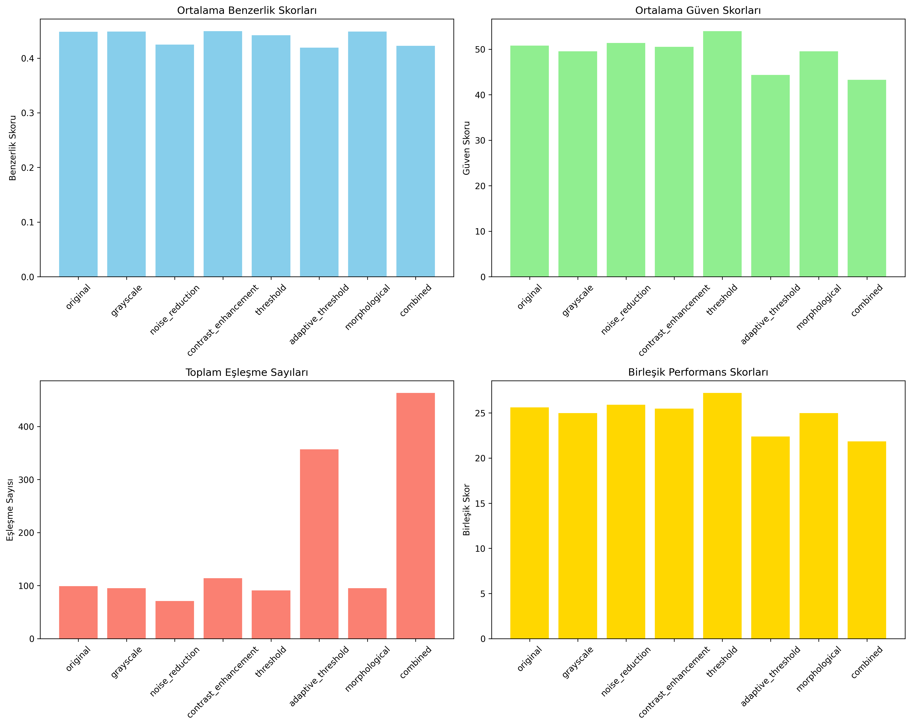
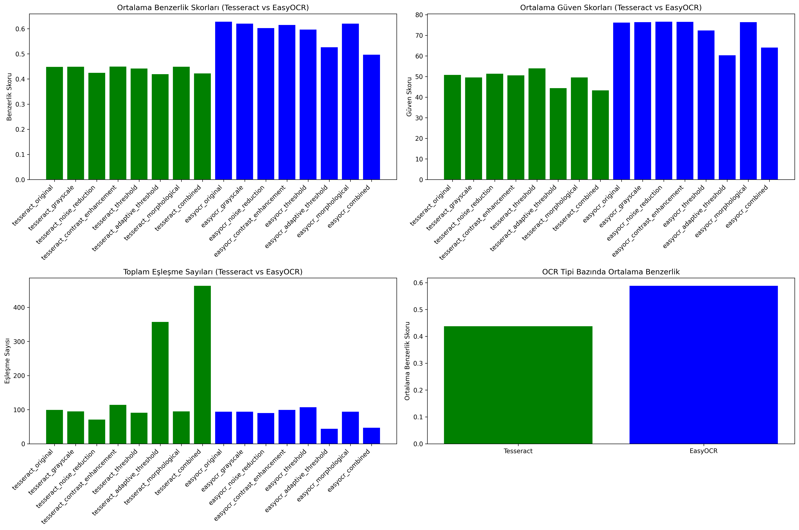
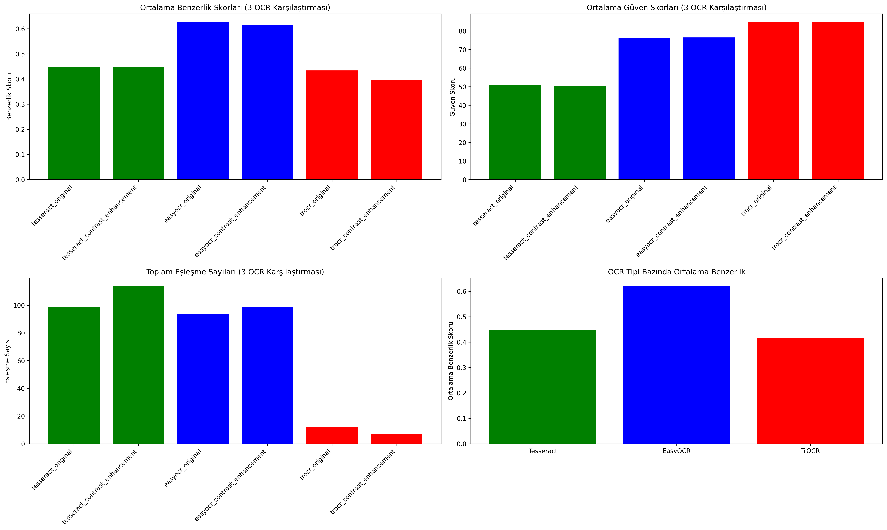

# OCR Etiket Okuma Sistemi

Bu proje, bir ürün etiketindeki metinleri okumak için farklı OCR (Optical Character Recognition) modellerini karşılaştıran bir sistemdir.

## 🎯 Proje Amacı

- **Tesseract**, **EasyOCR** ve **TrOCR** modellerini karşılaştırma
- Farklı ön işleme yöntemleri ile OCR performansını artırma
- Ground truth verileri ile OCR sonuçlarını değerlendirme
- Görsel raporlar ve istatistiksel analizler oluşturma

## 📋 Özellikler

### 🔍 Denenen OCR Modelleri
- **Tesseract**: Klasik OCR motoru
- **EasyOCR**: Modern, derin öğrenme tabanlı OCR
- **TrOCR**: Microsoft'un Transformer tabanlı OCR modeli

### 🛠️ Ön İşleme Yöntemleri
- **Orijinal**: Hiçbir ön işleme yapılmadan
- **Kontrast Artırma**: CLAHE (Contrast Limited Adaptive Histogram Equalization)
- **Gri Tonlama**: Renkli görüntüleri gri tonlamaya çevirme
- **Gürültü Azaltma**: Median blur ile gürültü temizleme
- **Threshold**: Otsu ve adaptif threshold yöntemleri
- **Morphological Operations**: Açma ve kapama işlemleri

### 📊 Raporlama Özellikleri
- **Görsel Çıktılar**: Bounding box'lı görüntüler
- **İstatistiksel Analiz**: Benzerlik skorları ve güven değerleri
- **Karşılaştırmalı Grafikler**: Farklı OCR modellerinin performans karşılaştırması
- **JSON/CSV Raporları**: Detaylı sonuç raporları

## 🚀 Kurulum

### Gereksinimler
```bash
pip install -r requirements.txt
```

## 📁 Proje Yapısı

```
OCRTask/
├── ocr_system.py              # Ana Tesseract OCR sistemi
├── test_ocr.py                # Test ve doğrulama scripti
├── easyocr_comparison.py      # Tesseract vs EasyOCR karşılaştırması
├── three_ocr_comparison.py    # 3 OCR modeli karşılaştırması
├── ground_truth.json          # Ground truth verileri
├── requirements.txt           # Python bağımlılıkları
├── images/                    # Test görüntüleri
└── outputs/                   # Çıktı dosyaları
```

## 🎮 Kullanım

### 1. Ana OCR Sistemi
```bash
python ocr_system.py
```
- Tesseract OCR ile tüm ön işleme yöntemlerini test eder
- Sonuçları `outputs/` klasörüne kaydeder

### 2. Test ve Doğrulama
```bash
python test_ocr.py
```
- Tek görüntü veya görüntü grubu için hızlı test
- Detaylı sonuç raporları

### 3. Tesseract vs EasyOCR Karşılaştırması
```bash
python easyocr_comparison.py
```
- İki OCR modelini karşılaştırır
- Sonuçları `outputs_comparison/` klasörüne kaydeder

### 4. 3 OCR Modeli Karşılaştırması
```bash
python three_ocr_comparison.py
```
- Tesseract, EasyOCR ve TrOCR modellerini karşılaştırır
- Sadece 'original' ve 'contrast_enhancement' yöntemlerini kullanır
- Sonuçları `outputs_three_ocr/` klasörüne kaydeder

## 📊 Çıktılar

### Görsel Çıktılar
- **Bounding Box'lar**: Farklı renklerle OCR sonuçları
  - 🟢 Yeşil: Tesseract sonuçları
  - 🔵 Mavi: EasyOCR sonuçları  
  - 🔴 Kırmızı: TrOCR sonuçları
  - 🟡 Sarı: Ground truth ile eşleşen metinler

### Rapor Dosyaları
- **JSON Raporları**: Detaylı analiz sonuçları
- **CSV Raporları**: Tablo formatında sonuçlar
- **Grafikler**: Performans karşılaştırma grafikleri

## 📈 Sonuçlar

### Performans Karşılaştırması

Aşağıdaki grafikler farklı OCR modellerinin performansını göstermektedir:

#### Tesseract OCR Sistemi Sonuçları


#### Tesseract vs EasyOCR Karşılaştırması


#### 3 OCR Modeli Karşılaştırması (Tesseract vs EasyOCR vs TrOCR)


## 🔧 Teknik Detaylar

### OCR Model Özellikleri

#### Tesseract
- Hızlı, hafif, iyi dokümante edilmiş ancak başarı düzeyi orta

#### EasyOCR
- Yüksek doğruluk, modern algoritma

#### TrOCR
- Transformer tabanlı yaklaşım, bu görev için uygun görünmüyor
